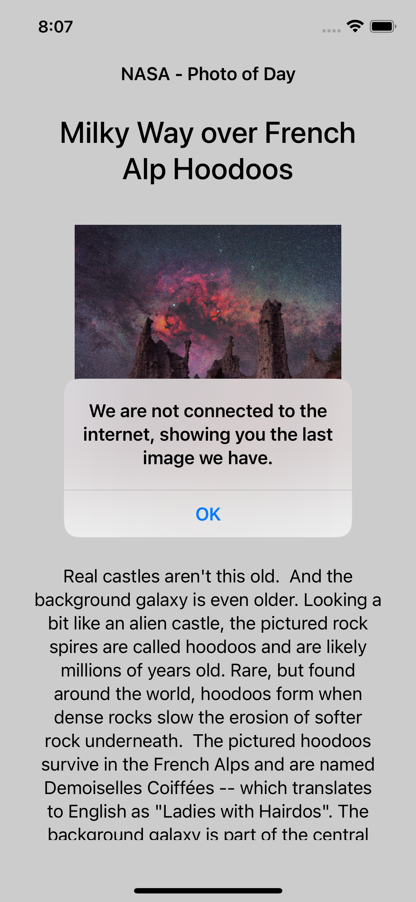
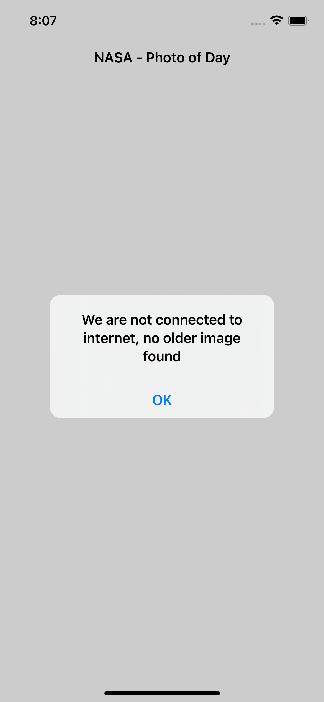

# NasaAPODApp-iOS

### About:
- Used MVVM design pattern.
- SwiftUI is used for developing UI.
- CoreData used for persistance storage when device is offline.
- Repository pattern used to create a common interface to fetch data from API & CoreData.
- ViewModel uses Observable design pattern to publish changes to the View.

To run the project, open the `NasaPODApp.xcodeproj` project file in Xcode.

All the usecases given in the problem statement are implemented.

(No third party dependencies are used in this project)

---

### Areas of Improvement:

These are some of the improvements that could be covered:

- Localizing the string constants to be fetched from a `.string` file, from a resource bundle.
- Making the endpoint & API key configurable by using `.plist` for configuration.
- Writing Unit & UI test cases
- Some enhancements to the UI, especially the error handling part. As of now, I have just added a UIAlert to show the error message.
- Adding a CI-CD pipeline to automate the build & testing process.

---

### Screenshots:

<table>
 <tr>
  <td>  </td>
  <td>  </td>
  <td>  </td> 
 </tr>
</table>
